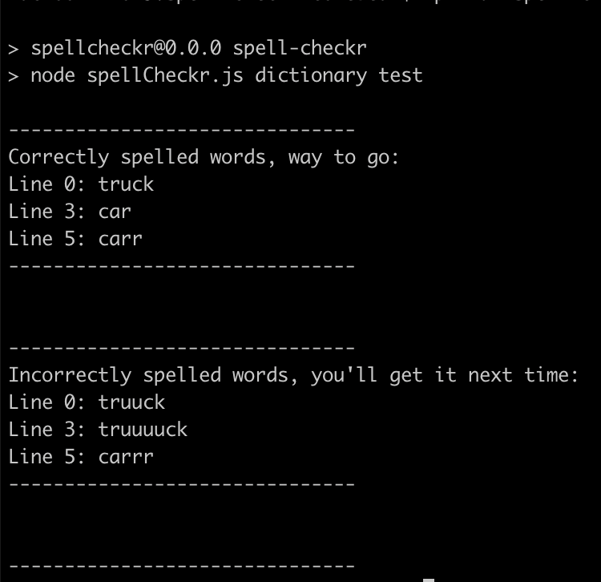

<div align="center">
    
</div>

# spell-checkr

One of the hottest new programs out there, Spell-checkr! This program utilizes a built in dictionary and will spell check a text file filled with words. Who needs Microsoft spell check when you have Spell-checkr?!

## How to run

Spell-checkr assumes you have NodeJS installed on your system.

Fork the repo and checkout `master`.

There's a file in this repository called `test.txt` inside of `files` e.g., `files/test.txt`.

In that file, provide any words you would like spell checked, in an individual line format:
```
first
second
third
```

Save your changes once you provide your words for sacrifice.

Then in a terminal, run:
```
npm run spell-checkr test
```

You should receive an output similar to the following upon completion

<div align="center">
    
</div>

## Current features

- The program outputs a list of incorrectly spelled words. - √
- The program includes the line ~and column~ number of the misspelled word - √

## More to come features

- For each misspelled word, the program outputs a list of suggested words.
- The program includes the column number of the misspelled word
- The program prints the misspelled word along with some surrounding context.
- The program handles proper nouns (person or place names, for example) correctly.
